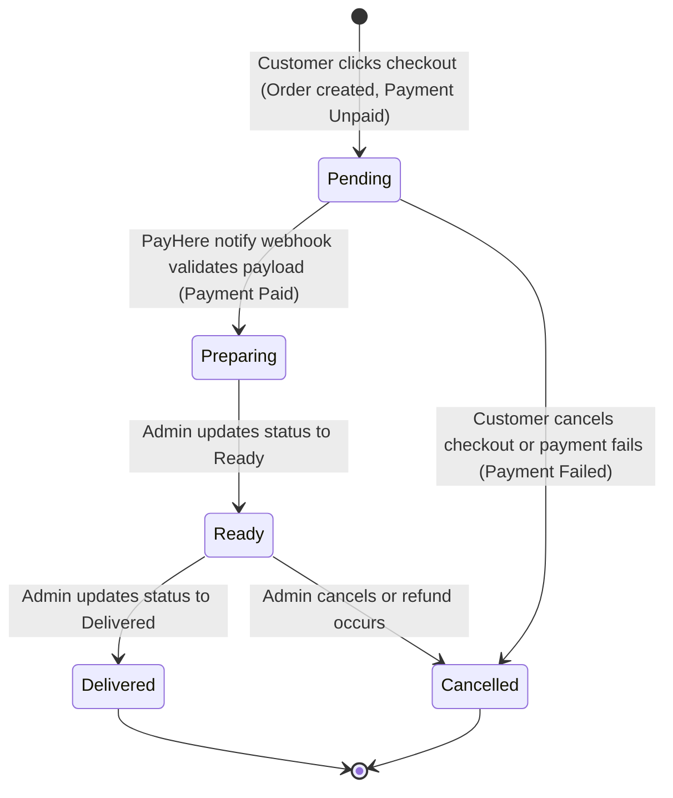

# Data Model: Core Food Ordering System

This document specifies the MongoDB database schemas (using Mongoose ODM) and state transitions for the Food Ordering System.

## Entities & Schemas

### 1. User
Represents customers and admins who access the system.

```typescript
{
  name:      { type: String, required: true },
  email:     { type: String, required: true, unique: true },
  password:  { type: String, required: true },
  phone:     { type: String },
  role:      { type: String, enum: ['customer', 'admin'], default: 'customer' }
}
```
* **Validation Rules**:
  - `email` must be a valid email string format and is marked as unique.
  - `password` is stored as a bcrypt hash on the database (never as cleartext).
  - `role` strictly restricted to `customer` and `admin`.

---

### 2. FoodItem
Represents dishes, drinks, or items available for customer purchase on the menu catalog.

```typescript
{
  name:        { type: String, required: true },
  description: { type: String },
  price:       { type: Number, required: true },
  category:    { type: String, enum: ['Pizza', 'Burger', 'Cake', 'Drink', 'Other'] },
  image:       { type: String },
  available:   { type: Boolean, default: true }
}
```
* **Validation Rules**:
  - `price` must be a positive number.
  - `category` strictly restricted to the 5 enum categories.

---

### 3. Order
Represents checkout transactions initialized by customers.

```typescript
{
  customer:      { type: Schema.Types.ObjectId, ref: 'User', required: true },
  items:         [
    {
      item:      { type: Schema.Types.ObjectId, ref: 'FoodItem' },
      name:      String,
      price:     Number,
      quantity:  Number
    }
  ],
  total:         { type: Number, required: true },
  status:        { type: String, enum: ['Pending', 'Preparing', 'Ready', 'Delivered', 'Cancelled'], default: 'Pending' },
  paymentStatus: { type: String, enum: ['Unpaid', 'Paid', 'Failed'], default: 'Unpaid' },
  orderId:       { type: String, unique: true } // Unique UUID or nanoid string generated before PayHere checkout
}
```
* **Validation Rules**:
  - The nested order items map historical catalog snapshots (`name`, `price` at order time) to maintain data consistency in case item price or availability is edited later.
  - `total` must match the sum of individual order item price times quantity.
  - `orderId` must be unique to prevent PayHere reference collisions.

---

### 4. Payment
Represents the gateway payment details returned from the PayHere Webhook execution.

```typescript
{
  order:          { type: Schema.Types.ObjectId, ref: 'Order' },
  paymentId:      String,   // returned by PayHere
  status:         String,   // 2 = Success, 0 = Pending, -1 = Cancelled, -2 = Failed
  amount:         Number,
  currency:       { type: String, default: 'LKR' },
  method:         String,
  payhereRawData: Object    // Complete notify_url payload object
}
```

---

## State Transitions

### Order Status Flow
An order transitions through the following lifecycle states:



### Transition Integrity
- The backend MUST only update an order's status to `Preparing` (upon receipt of a success payment notify callback) if the order is currently in the `Pending` state.
- Order transitions from `Preparing` to `Ready` or `Delivered` require administrative permissions and session validation (`adminGuard` check).
